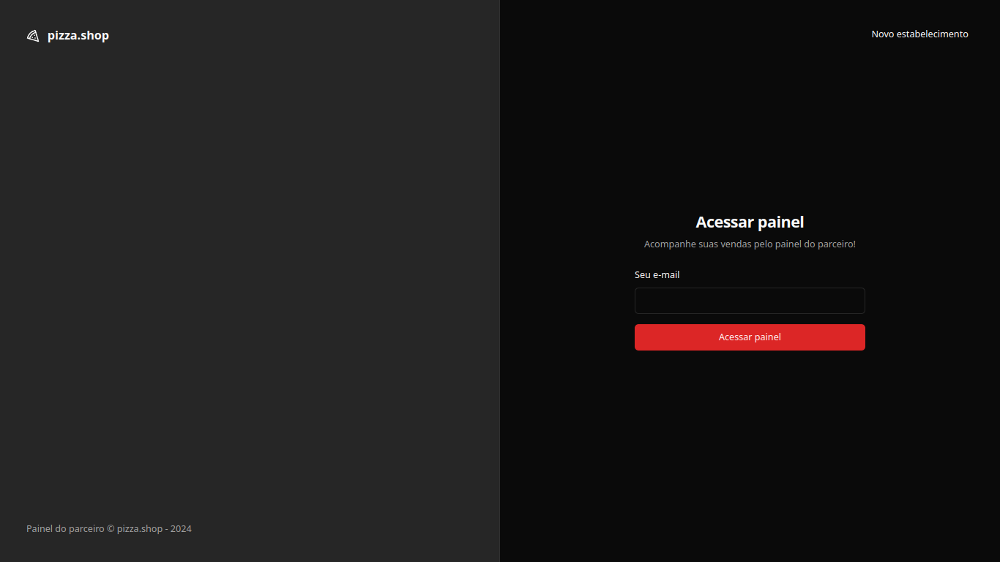
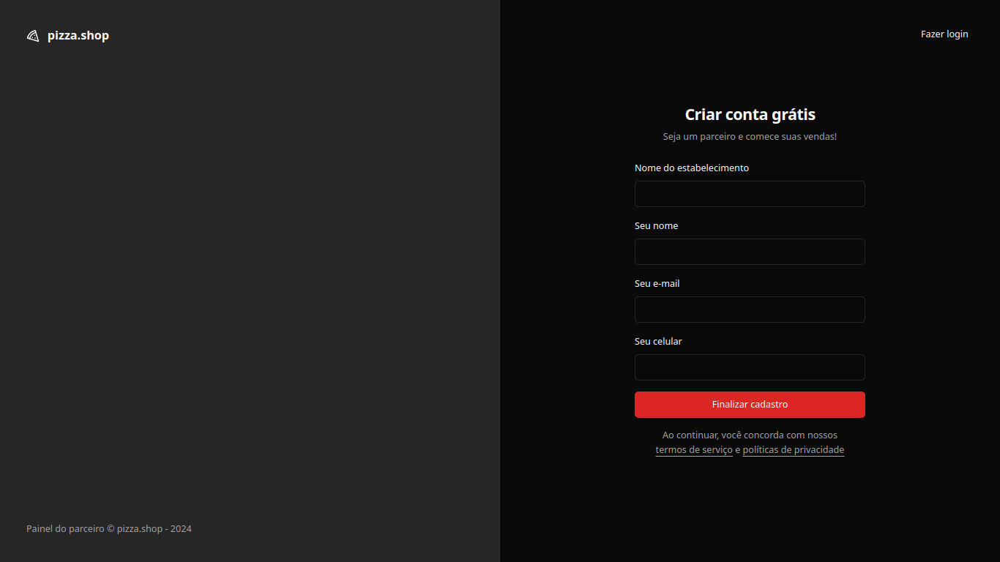
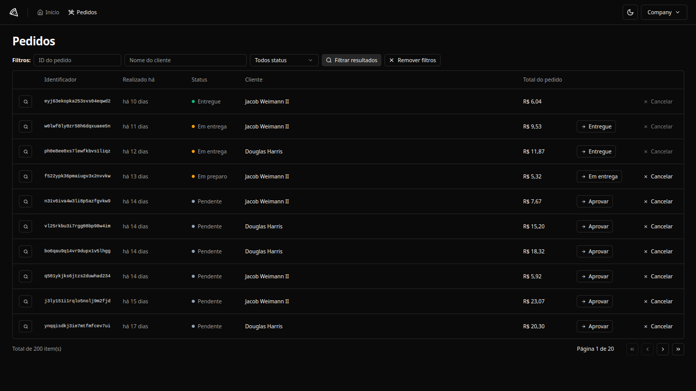
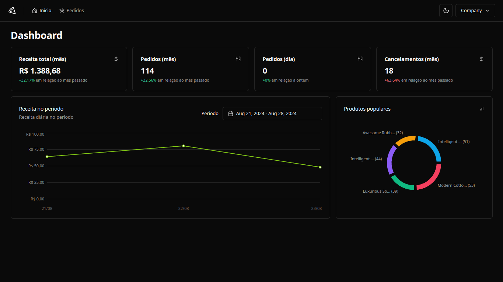

<h1 align="center"> <strong>🍕 Dashboard Pizza</strong></h1>

<p align="center">


</p>

<h2 id="layout">🎨 Layout</h2>
<p align="center"  justify-content="space-between">
  
  
  
  
</p>


<br />

# 📕 About
Dashboard for establishment management and order control.

</br>

# 🛠️Technologies:
This project was made using the follow technologies:

[](#) 
[](#) 

[](https://skillicons.dev)


# 🚀Features

* Establishment registration
* Establishment login (magic link)
* Customer registration
* Creation of new orders
* Menu management
* Evaluation management
* Order management
* Establishment profile management
* Metrics for dashboard


# 🏃Getting Started

```sh
#  Clone Repository
$ git clone https://github.com/wesleywcr/dashboard-pizzashop.git

# Go to the project folder
$ cd dashboard-pizzashop
# Install Dependencies
$ pnpm install
# Start application
$ pnpm run dev
```

# 🤝 Contributing

- Fork this repository
- Create a branch with your feature: `git checkout -b my-feature`
- Commit your changes: `git commit -m 'feat: My new feature'`
- Push your branch: `git push origin my-feature`
# 

Released in 2024.
Made with ❤️ by [Wesley Rodrigues](https://github.com/wesleywcr)🤙👊
